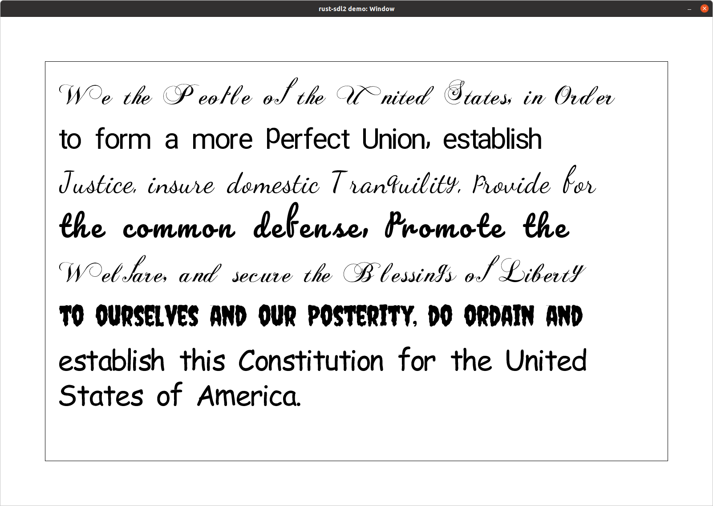
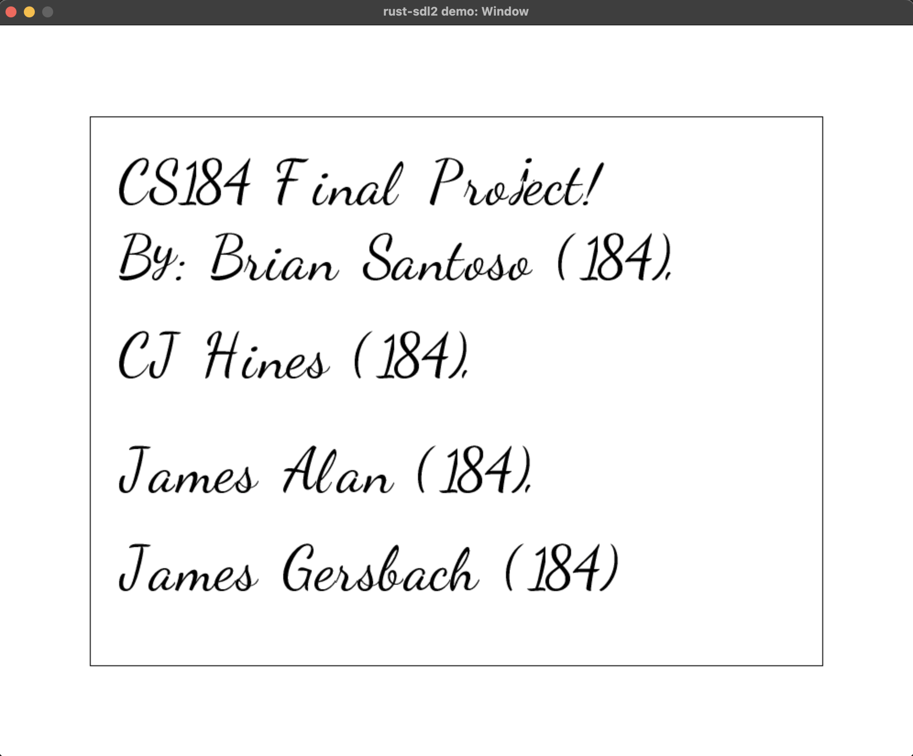
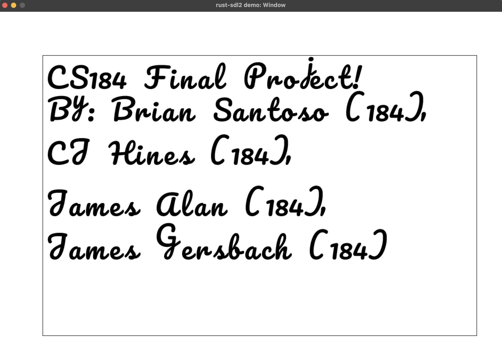
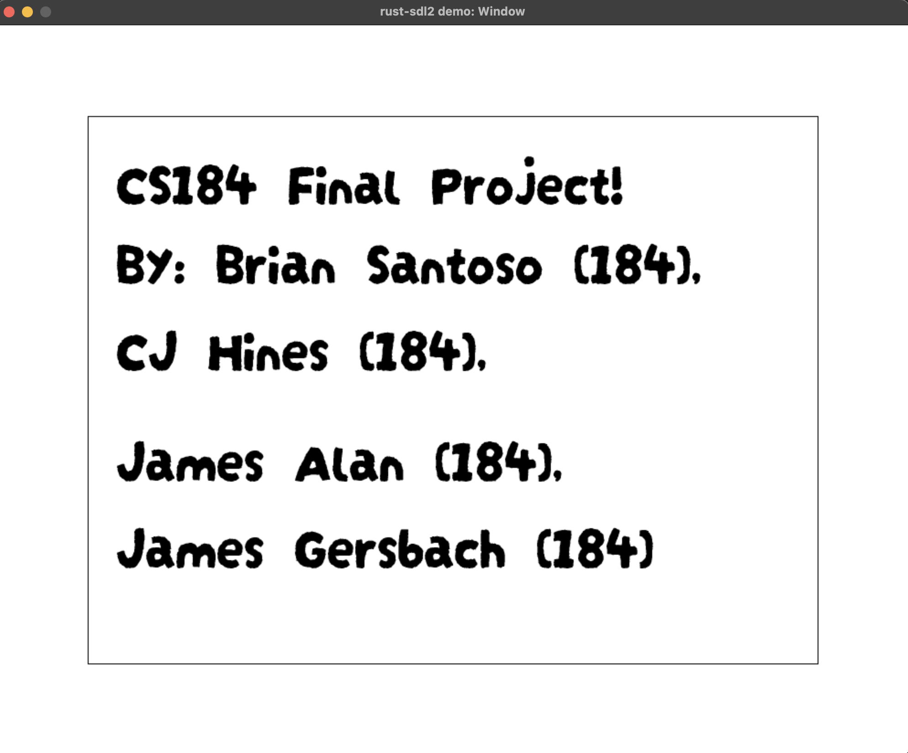

# font-rendering-engine
CS 184 Final Project

<h1 align="middle">CS 184: Computer Graphics and Imaging, Spring 2023</h1>
     
    
    <h1 align="middle">Final Project: Font Rendering Engine</h1>
    <h2 align="middle">James MacFadyen, James Gersbach, CJ Hines, and Brian Santoso</h2>
    
See <a href="https://docs.google.com/presentation/d/1hLsOYjvpz6S-rDLRNTochSNVQFm8AlVthpq2-A-JmOM/edit?usp=sharing" target="_blank">slides</a> and <a href="https://youtu.be/ocB_TURlIUI" target="_blank">video summary</a>.

    <h3 align="middle">Abstract</h3>
      

        We built a font rendering engine in rust for our final project employing two external libraries, ttf_parser and rust-sdl2. The engine utilized Bezier curves from a ttf file to generate glyphs, which were then assembled using ray intersections to form readable sentences and paragraphs. Our implementation also delivers modes for supersampling and tracks performance metrics to ensure efficient rendering. Overall, the project aimed to create a high-quality font rendering engine that could generate legible text in various fonts with accurate tracking.
      

    <h3 align="middle">Technical approach</h3>
      
The first stage of the render is to translate the segments that <code>ttf_parser</code> returns into something usable (making the points not relative to the previous segment and storing them in a vector for convenence). Next, we decide how many pixels on the target display our render will take up. We use the formula <code>ratio = point_size * resolution / (72 * units_per_em)</code>, where <code>point_size</code> is how big we want the characters to appear on the display (12 pt, 24 pt, and so on), <code>resolution</code> is the pixel density of the target display (144 or 227 on a recent MacBook, for reference), and <code>units_per_em</code> is how many font units translate into a font point. The <code>72</code> in the denominator refers to how 72 pixels-per-inch displays were almost universal at the time of the TTF specification, and <code>units_per_em</code> is defined based on that pixel density. With this, we simply multiply the height and width of the character's bounding box by <code>ratio</code> to get the number of pixels our character needs.

      
The second stage of the render is to iterate over each pixel we have decided our character will take up. How we decide to fill a pixel will depend on our sampling mode. Without supersampling, we simply sample from the middle of the pixel and fill it in with black if the sample point is within the outline of the character (the formula for this will be described in the next paragraph). With supersampling, we take $N^2$ evenly spaced points within the pixel. The shading of the pixel is decided by how many of these points are within the outline: fully white if none of the samples are in-bounds and fully black if all $N^2$ samples are in-bounds.

      
To test whether a sample point is in-bounds (within the filled-in portion of the character), we have to compare it against every segment that makes up the character. We draw a ray originating from the sample point with an arbitrary direction (we picked $(1, 0)$) and count the number of segments it intersects with. If the number is odd, we fill in the point. While the selection of direction $(1, 0)$ for the ray was arbitrary, it ended up saving us time down the line: Given a Bezier curve with points $(x_i, y_i)$ and a test point $(x, y)$, if we translate the curve to $(x_i - x, y_i - y)$ then we can simply find all solutions to $B_y(t) = 0$. This simplifies the Bezier-Ray intersection problem into a straightforward root-finding exercise, where the intersection is valid if it has any solutions where $t \geq 0$.
      
      
To render paragraphs, we render sequences of characters with each glyph's location determined by the bounding box of the previous character plus an offset. If the position of the next character to be drawn exceeds the bounding box of the drawing area, we insert a new line and resume drawing characters there.

      
We also provide some metrics to compare the quality of different rendering modes (default sampling, 2x2, 3x3, etc.). We first pick a sample character and a number of samples to take from within the character's bounding box (we used 10,000). We then find a random point within the box. We test if that point would be considered in-bounds (i.e. in the filled-in portion of the outline) at the random point and at the nearest sampling point in the different sample methods. For example, if we generated the random point $(3.2, 5.8)$ we would sample from $(3.5, 5.5)$ for default sampling and $(3.33, 5.66)$ for 2x2 supersampling. If the random point and the corresponding sample point agree on whether their points are in-bounds, this is a hit. If they disagree, this is a miss. We count the number of misses for each sampling method, where less misses indicates that a rendering method produces an image that is closer to the ideal representation of the character. A table containing metrics for a selection of fonts (sans-serif, script, and CJK) and characters is provided in the Results section of this report.

      
The main roadblock we encountered was the difficulty in juggling the different coordinate systems used in this project. Not only is the conversion between font units and pixels display-dependent (as we need to know how many pixels there are per inch in order to create pixel-perfect outputs), but the two systems use different origins: (0, 0) is in the top-left for the renderer and the bottom-left for the actual font file. To understand the conversion, we had to trace out a simple character (in our case, 'L') on a graph and work out how each corner of the character translates to a different scale and origin.

      
In building this font rendering engine, we gained a deep appreciation for the complexity that goes into something that we barely (if ever) think about when we use computers or read printed media. The best font rendering engine is one that very few people will ever acknowledge: If the engine is working well, no one thinks to thank its authors for their excellent reading experience. But if it performs poorly, people will quickly wonder why someone delivered software where the letters are jagged or blurry. Because of this, font rendering is concentrated in a small number of battle-tested engines (primarily FreeType) that have had decades to meet the incredible challenge of making software that no one will notice.

    <h3 align="middle">Results</h3>
    <u>Render Images</u>
    

      <table width="100%">
        <tr>
          <td>
            
            <figcaption align="middle">  Font = Dancing Script Regular. Supersampling 3x3. </figcaption>
          </td>
          <td>
            
            <figcaption align="middle"> Font = Chopin Script. Supersampling 3x3. </figcaption>
          </td>
        </tr>
         
        <tr>
          <td>
            
            <figcaption align="middle"> Font = Roboto Regular. Supersampling 3x3. </figcaption>
          </td>
          <td>
            
            <figcaption align="middle"> Font = Pacifico Regular. Supersampling 3x3. </figcaption>
          </td>
        </tr>
         
        <tr>
          <td>
            
            <figcaption align="middle"> Font = DarumadropOne Regular. Supersampling 3x3. </figcaption>
          </td>
        </tr>
      </table>
    

     
    <u>Render Gifs</u>
    

     
        
        <figcaption style="text-align:center"> No SuperSampling </figcaption>
         
        
        <figcaption style="text-align:center"> SuperSampling 2x2 </figcaption>
         
        
        <figcaption style="text-align:center"> SuperSampling 3x3 </figcaption>
